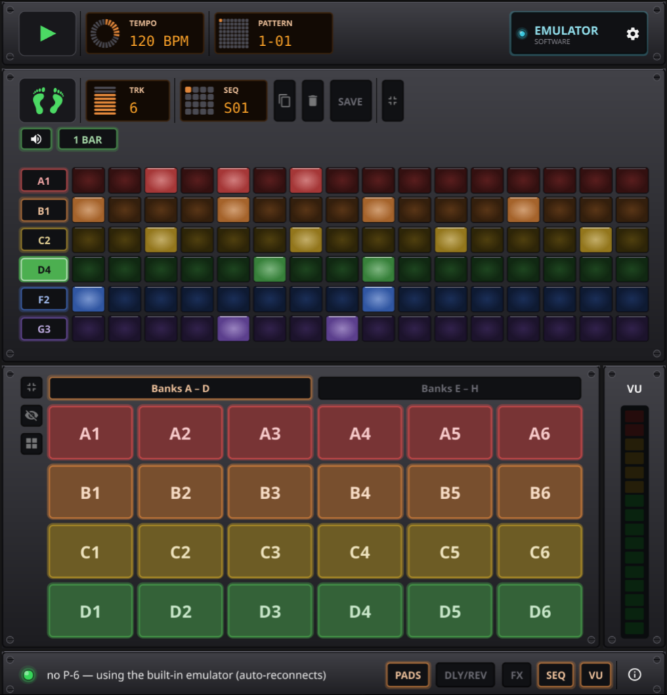
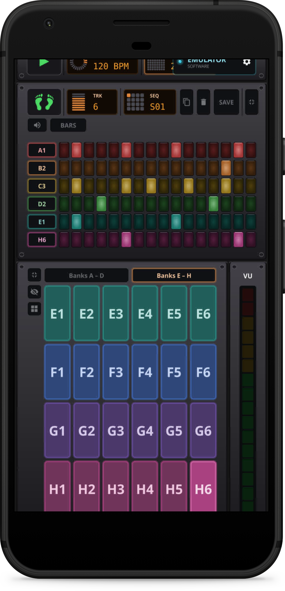

# RP6

A touch-friendly controller for the **Roland P-6** (AIRA Compact sampler) — plus
a built-in software sampler and sequencer so you can play it even without the hardware.

Works on Linux desktop, [in the browser](https://rp6.rbel.co) (experimental), and on Android. [Fyne](https://fyne.io) powered.

Supports Roland P-6 sampler and [Adafruit Macropad](/docs/hardware/macropad/README.md) as external USB MIDI hardware.

  
  &nbsp;&nbsp;
  

__Note: RP6 is currently alpha quality__

## Features

- **48 pads, banks A–H** — finger-friendly grid, paged A–D / E–H (or a dense
  single-page view). Tap to trigger; the last hit is highlighted.
- **Step sequencer** — up to 8 tracks, each 1–4 bars and looping at its own
  length (polymeter), 16 steps/bar, tempo-synced, with per-track **mute**. Assign
  a pad to a track with a tap, program steps, press play. Save/load **16
  sequence slots**; your work autosaves and reloads on next launch.
  ([sequencer guide](docs/sequencer.md))
- **Transport & tempo** — illuminated Play/Stop, a TEMPO knob and a PATTERN
  selector, driving the P-6 over MIDI clock.
- **Effects** — a per-pad effects rack (tempo-synced **Roll**) and global
  **Delay / Reverb** controls.
- **Built-in emulator** — no P-6? RP6 ships with a playable "modular-hits" sample
  kit, so it makes sound out of the box. Tap the device badge to switch between
  the emulator and a connected P-6.
- **Activity / VU meter** — a level meter on the right (real USB-audio VU on
  desktop builds).
- **Amber hardware-style UI** — backlit rack panels, knobs and 7-segment
  readouts; fully touch-operable (no right-click or keyboard needed).

## Running it

There are pre-built Android APK and Flatpak packages in [releases](/releases).

Plug in the P-6 or an [Adafruit MacroPad](/docs/hardware/macropad/README.md) over USB and it connects automatically; unplug and RP6 falls back to the built-in emulator, reconnecting when it reappears. No hardware? It
just runs the emulator.

## Using it with a P-6

For full control, set these on the P-6 (MENU):

- **MIDI Clock Sync (SYnC) = USB** — so Play/Stop and the TEMPO knob drive it.
- **Rx Program Change = On** — so the PATTERN selector switches patterns.

Pads always trigger by note, so you can play all 48 pads from the grid, a
connected controller, or the sequencer regardless of the above.

## Without a P-6 (emulator)

Without a P-6 connected, RP6 uses a built-in software sampler.

The bundled kit is one-shot hits from the “Modular-Hits” pack by *publicsamples*
(https://github.com/publicsamples/Modular-Hits).

## With the Adafruit Macropad

You'll need to setup your macropad loading the circuitpython code located [here](/docs/hardware/macropad/code.py).

## License

MIT — see [LICENSE](LICENSE). RP6 is an independent project and is not affiliated
with or endorsed by Roland.
